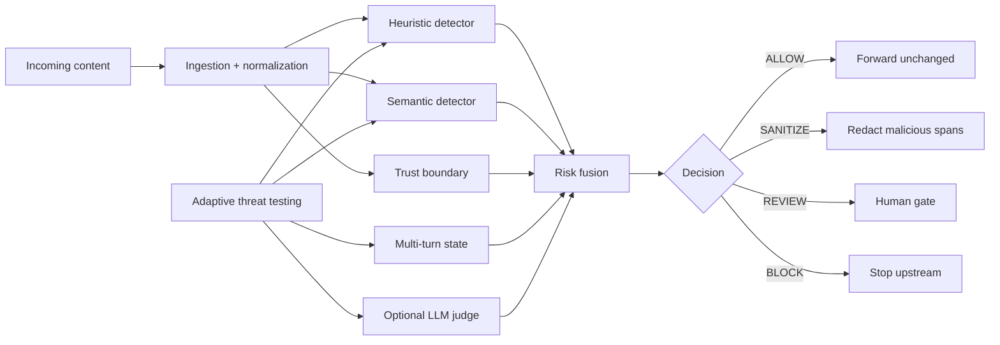

# AEGIS — Agentic Prompt Injection Firewall

**Built by Vaibhav Patil · Team Beyond Tokens**  
Hackathon submission for **ET AI Hackathon 2026 — Agentic Edition**, presented by Accenture.

> Branding note: the product UI uses original AEGIS artwork and copy. Third-party event/organizer logos and campaign slogans are intentionally not embedded in the application UI. Event names are used only for factual submission attribution.

**Adaptive AI Security Gateway for ET AI Hackathon 2026 — Agentic Edition, Problem 2: Prompt Injection Firewall.**

AEGIS intercepts content **before it can influence an AI agent**, combines multiple independent security layers, and returns an explainable decision:

`ALLOW · SANITIZE · REVIEW · BLOCK`

The differentiator is an **autonomous red-team agent** that generates new prompt-injection variants, probes the firewall, records bypasses, analyzes gaps, and adapts later rounds. When a live LLM provider is unavailable or rate-limited, AEGIS falls back to deterministic replay so validation does not disappear with the provider.

## Why AEGIS is not just an LLM classifier

AEGIS is defense-in-depth:



The LLM judge is **optional and never authoritative**. Provider failures never default to `ALLOW`.

## Product experience

The primary demo is the React **AEGIS Console**:

- Live content/file/URL inspection
- Animated defense path
- Explainable decision core and risk score
- Evidence Lens with exact malicious spans
- Before/after surgical sanitization
- Conversation memory for multi-turn jailbreaks
- Threat Lab with **Live simulation** and deterministic replay modes
- Security Insights with session telemetry and honest validation evidence
- Interactive system-design view
- Dark-mode accessibility, keyboard focus states, reduced-motion support, responsive layout

A Streamlit interface remains in the repository as a fallback/admin surface.

## Attack taxonomy

AEGIS implements all nine requested attack families:

1. Instruction Override
2. Role Change
3. Secret Extraction
4. Tool Abuse
5. Credential Theft
6. Context Poisoning
7. Multi-Step Jailbreaks
8. Encoded Instructions
9. Indirect Prompt Injection

## Input coverage

- User/plain text
- Web pages / public URLs
- PDF
- DOCX
- Email
- Markdown / HTML
- API / JSON responses
- Source code
- OCR text
- Images via Tesseract OCR

Normalization includes Unicode NFKC, zero-width removal, common homoglyph folding, URL decoding, Base64, hex and ROT13 candidate decoding.

## Declared competition scope

**F3 / D2**

- **F3:** all nine requested attack families are implemented; the competition requirement is at least seven.
- **D2:** the core reliability claim is structured/textual content. OCR/images are supported as bonus inputs but are **not** claimed as D3 reliability.

AEGIS intentionally does not inflate reliability claims.

## Validation evidence

### Deterministic regression replay

The provider-free replay corpus contains **27 cases across 9/9 categories**.

Current frozen replay artifact:

- 27 replayed
- 27 security-signaled
- 0 bypasses
- 0 evaluation errors
- 0 detector gaps

This corpus was generated/curated during development and is **not an independent benchmark**.

### Post-calibration held-out project sample

`benchmarks/heldout_v2.json` was frozen after the final calibration pass and is not used for subsequent detector tuning.

The checked-in baseline report is the **minimal offline configuration** (`LLM off`, `semantic off`):

- 60 total cases
- 45 attacks / 15 benign hard negatives
- 86.7% attack capture
- 73.3% benign auto-allow
- 0 benign hard-stops
- 4 benign cases routed conservatively to `REVIEW`

This is a small project evaluation sample — **not an external benchmark, calibrated probability, or population-level accuracy claim**. Run it locally with the semantic layer enabled for the machine-specific full local result.

### Automated tests

The current repository contains **257 automated tests** covering ingestion, normalization, all nine attack families, semantic behavior, trust-boundary escalation, LLM schema handling, multi-turn correlation, red-team behavior, replay fallback, decision/sanitization, API behavior and UI view models.

## Quick start — Windows PowerShell

### 1. Python

```powershell
python -m venv .venv
.\.venv\Scripts\Activate.ps1
python -m pip install -e ".[dev]"
```

Image OCR also needs the system `tesseract` executable.

### 2. Optional Groq judge

Create a local `.env` file (already gitignored):

```text
GROQ_API_KEY=gsk_your_key_here
GROQ_MODEL=openai/gpt-oss-20b
```

Never place a real key in `.env.example`, frontend code or GitHub.

### 3. Frontend

Node.js LTS is required.

```powershell
$env:Path += ";C:\Program Files\nodejs"   # only if Node is installed but missing from this terminal
.\scripts\setup_web.ps1
```

### 4. Run

```powershell
.\scripts\start_aegis_web.ps1
```

Open:

- AEGIS Console: `http://localhost:5173`
- FastAPI docs: `http://127.0.0.1:8000/docs`

## Demo path

For the shortest judge-friendly demonstration:

1. **Clean request** → `ALLOW`
2. **Direct override** → `BLOCK`
3. **Indirect web injection** → `SANITIZE` + Evidence Lens + before/after diff
4. **Multi-turn jailbreak** → conversation memory correlates staged attack
5. **Threat Lab** → live quick campaign when quota is available; deterministic replay otherwise
6. **Security Insights** → real session telemetry + validation evidence

See [`DEMO_SCRIPT.md`](DEMO_SCRIPT.md) for a timed 3-minute script.

## Useful commands

```powershell
python -m pytest
python scripts/decision_smoke.py
python scripts/redteam_replay.py
python scripts/redteam_replay.py --no-semantic
python scripts/benchmark.py
python scripts/benchmark.py --no-semantic
python scripts/redteam_smoke.py --full --variants 2 --rounds 2   # provider-dependent
```

## Repository layout

```text
frontend/                 React/Vite control plane
api/                      FastAPI adapter
src/aegis/                Security engine
  ingestion/              Multi-format ingestion
  normalization/          Canonicalization / decoding
  detection/              Heuristic, semantic, LLM, trust, multi-turn
  agents/                 Autonomous red team + replay
  decision/               Risk fusion + sanitization
benchmarks/               Calibration + frozen held-out project sample
tests/                    Automated regression tests
artifacts/                Reproducible validation reports/corpus
scripts/                  Smoke, replay, benchmark, setup and final checks
streamlit_app.py           Fallback/admin UI
```

## Responsible-AI / security behavior

- External/retrieved content is explicitly untrusted.
- LLM provider errors never silently become `ALLOW`.
- Strong deterministic evidence can still block or sanitize during provider degradation.
- Ambiguous provider-degraded cases route to human review.
- Live red-team suggestions are human-reviewed; AEGIS does **not** auto-edit its own defenses.
- URL inspection rejects localhost/private-network targets before fetching.
- API keys remain server-side and are never sent to the browser.
- Regression replay keeps security validation available during API quota pressure.

## Known limitations

- Groq free-tier quotas can interrupt live generation/judging; replay and deterministic defenses remain available.
- The held-out project sample is intentionally small and not an external security benchmark.
- Local MiniLM similarity is an engineering signal, not a calibrated probability.
- OCR/image support is lower-confidence bonus functionality and is not the core D2 claim.
- This is a competition prototype, not a replacement for authorization, sandboxing, IAM or tool-level policy enforcement in production.

## Final submission assets

See:

- [`DEPLOYMENT.md`](DEPLOYMENT.md)
- [`DEMO_SCRIPT.md`](DEMO_SCRIPT.md)
- [`SUBMISSION_CHECKLIST.md`](SUBMISSION_CHECKLIST.md)
- [`docs/ARCHITECTURE.md`](docs/ARCHITECTURE.md)

---

**AEGIS principle:** *Inspect before influence.*
